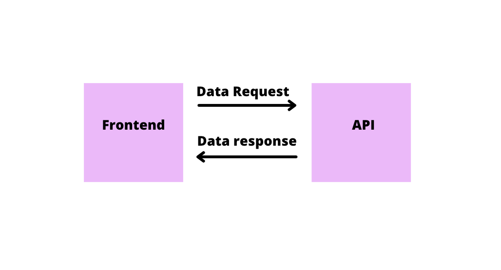

# Best practices for JWT tokens

JWTs are the latest technology used for securely transmitting information between backend and frontend as JSON objects. While using a React app for your frontend, there's a high chance that your data setup looks like this.

  

 

And as you may know, this data setup requires a way of securing your calls from the malicious hackers who can steal your data. One of the best ways to do that is using JWTs.

## 1. When and where to use JWT tokens

On the first look, it seems to be a good idea to use JWTs to send data across platforms. JWT tokens contain data and transfer that data between the front and backend. Since the information is stored in an encoded format inside JWTs, one can encode the relevant data and send it from backend to frontend. Although this looks like a simple and efficient way to send data, it has two problems.

As the developers use JWTs for data transfer, it would cause problems as soon as we decide to make changes to the structure of the JWTs, as the integrated apps won't be ready for the new format.

If everybody can read what is inside the token, security seems to be a big concern. If case any sensitive data is being transferred through the tokens, anybody and everybody can read it. Attackers can also use any information about your API.

Hence, JWTs as Access tokens are used as bearer tokens, decoded by the API, and validated before sending the response.

## 2. Choosing the correct algorithm

JWTs can be signed with numerous signing algorithms. An `alg` claim in the header would indicate which algorithm has been used for signing or encryption, whether the token is signed (a JWS) or encrypted (a JWE).

The most common type of signing algorithms are RS256, SHA-256 and P-256.

There is a case of a `none` value in the `alg` claim which means that the JWS is not signed. This option is generally not recommended, and you should be sure what you're doing if you want to enable unsigned JWTs. This would usually mean that you have substantial certainty of the identity of both the token issuer and the client who uses the token, and you're sure that no party could have tampered with the token.

## 3. Where to store JWTs in the frontend

Although many people would argue that there isn't any need to store JWT tokens in the frontend at all, your sessions and cookies would do the job for you. But if it is necessary for you to keep your JWTs, the options you get are-

- **Local Storage**
- **Your React State**
- **HttpOnly Cookie**

Now, storing your JWTs in localstorage would be the least secure way for your application.

And although saving the token in your react state seems to be the most secured one, it doesn't come out to be the practical use case, as the data stored in your react you would lose state if you refresh the page.

A better, more secure way is to store JWT in HttpOnly cookies. Accessing cookies by javascript not possible and hence, no tampering would be followed.

## 4. Should not use for Session management

An increasing number of frontend developers claim JWTs have some benefits as a session retention mechanism instead of session cookies and centralized sessions. At the first look, using JWTs for session tokens might seem to be a bright idea, but in reality, JWT should not be considered a good option for session handling. JWTs were never intended to use with sessions, and using them in such a way may lower your applications' security.
With the complex standards of JWTs, it is easier for the attackers to clone them and pretend to be someone else.
Last but not least, as JWTs are extensive, using them in cookies brings a huge per-request cost, since it takes a lot of space to store a JWT token with significant data. So, it is best not to use them as session tokens.

## 5. Signing the Token

JWT signature is the fundamental security feature that ensures data (payload) within the token has not been altered. An important point one should note here is that the signature is used to sign the payload of the token and the header. This signature is developed by the server using a private key. This private key is an integral part of the JWT signature. Also, to differentiate between two tokens signed with the same signature, a random id is attached to the claims. That makes sure that no two tokens are similar. The security of your JWT depends on two factors-

- **The secret key should be kept SECRET**
- **The minimum key length must equal the size of bits of the hash function used along with the HMAC algorithm.**

As we discussed the importance os signing the tokens, one thing to mention here is that try to avoid using symmetric signing. When using symmetric keys, the secret should be sharded between all the parties. Hence, with the increasing number of involved parties, it becomes more and more difficult to guard the secret's safety and replace it in case it is revealed.

Another problem with symmetric signing is the proof of who signed the key. When using asymmetric keys, you're sure that the JWT was signed by whoever owns the private key. In the case of symmetric signing, any party with access to the secret can also sign the tokens.

If, for some reason, you have to use symmetric signing, try to use ephemeral secrets, which will help increase security.

## Final Thoughts

JWT is a simple and reliable mechanism to share confidential data between two parties. But, while using JWT, you should be aware of how to maximize your security by applying the best possible ways and practices intended for JWTs.
